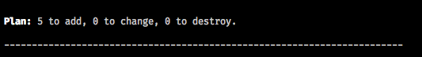
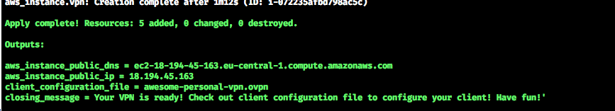

# Terraform OpenVPN

Terraform declarations for Single node OpenVPN infrastructure.
You can have your pay as you go personal VPN in minutes! And you can destroy your environment whenever you want!

### Prerequisites

`Terraform v0.11.3`

Check your version.

```
$ terraform -v

```

### Installing

Install `Terrafomr`, you can use [brew](https://brew.sh/) if you're on Mac OS X.

```
$ brew install terraform
```

## Usage

Make sure you provided AWS credentials to your environment.

You can simply export:
```Bash
export AWS_ACCESS_KEY_ID=(your access key id)
export AWS_SECRET_ACCESS_KEY=(your secret access key)
```

Or, you can use something like [awsudo](https://github.com/makethunder/awsudo) if you are using multiple accounts in your system:
```Bash
$ awsudo -u personal env | grep AWS
AWS_ACCESS_KEY_ID='<jadajada>'
AWS_SECRET_ACCESS_KEY='<blablabla>'
```

Then plan your changes:
```Bash
$ terraform plan
```
If everything is ok, you should see something like:



If everything looks good, you can apply your plan, it will take couple of minutes:

```Bash
$ terraform apply
```

If everything is ok, you should see something like:



Booom! You did it!

### Client Setup

Use generated file with an OpenVPN client. For example, you can use [Tunnelblick](https://openvpn.net/index.php/access-server/docs/admin-guides/183-how-to-connect-to-access-server-from-a-mac.html) for Mac OS X.

If Tunnelblick is installed, just go to your console:

```Bash
$ open awesome-personal-vpn.ovpn
```

Your VPN is ready! Have fun!

## Built With

* [OpenVPN](https://openvpn.net/)
* [Terraform](https://www.terraform.io/)
* [Docker](https://www.docker.com/)
* [Docker OpenVPN Image](https://hub.docker.com/r/kylemanna/openvpn/)

Special thanks to [@kylemanna](https://github.com/kylemanna) for [docker-openvpn](https://github.com/kylemanna/docker-openvpn)

## Contributing

1. Fork it!
2. Create your feature branch: `git checkout -b my-new-feature`
3. Commit your changes: `git commit -am 'Add some feature'`
4. Push to the branch: `git push origin my-new-feature`
5. Submit a pull request

## Versioning

We use [SemVer](http://semver.org/) for versioning. For the versions available, see the [tags on this repository](https://github.com/kakkoyun/terraform-openvpn/tags).

## Authors

* **Kemal Akkoyun** - *Initial work* - [kakkoyun](https://github.com/kakkoyun)

See also the list of [contributors](https://github.com/kakkoyun/terraform-openvpn/contributors) who participated in this project.

## License

This project is licensed under the GNU General Public License v3.0 - see the [LICENCE](LICENCE) file for details
